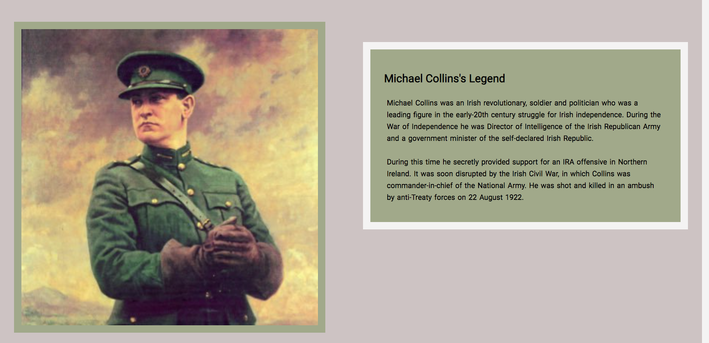
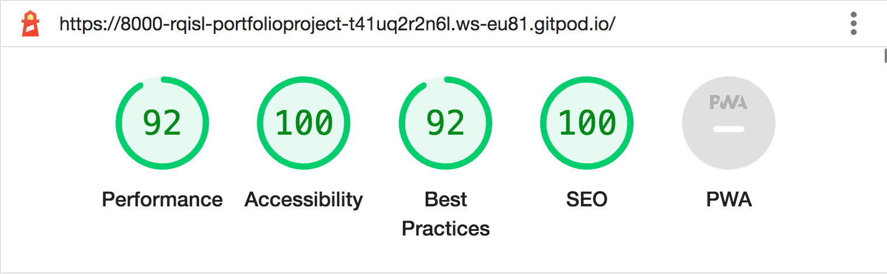
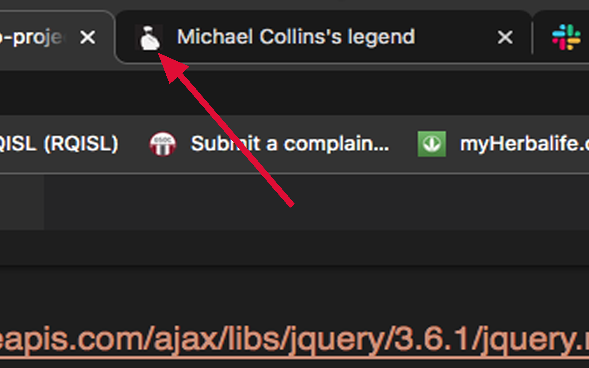
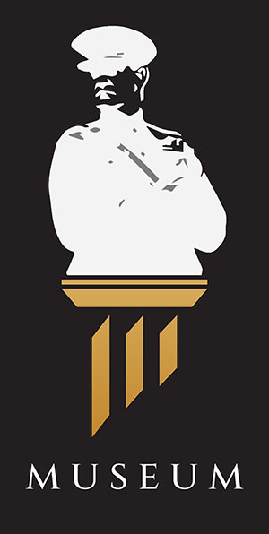
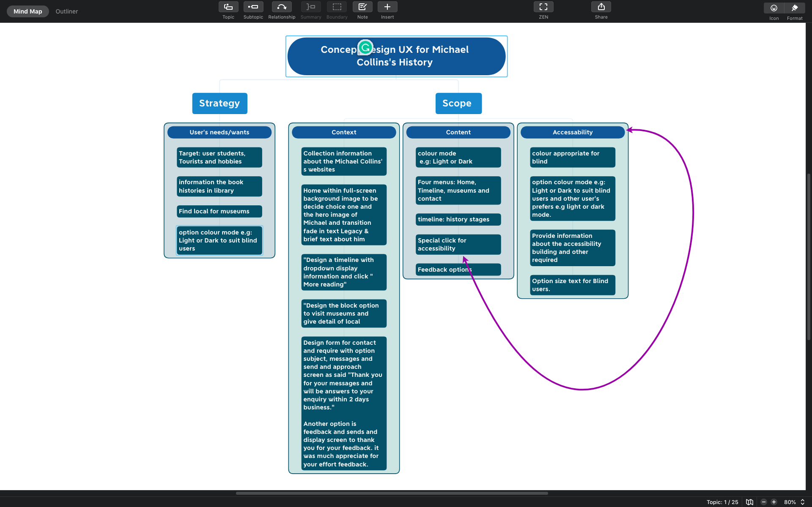
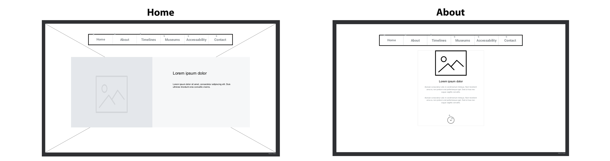
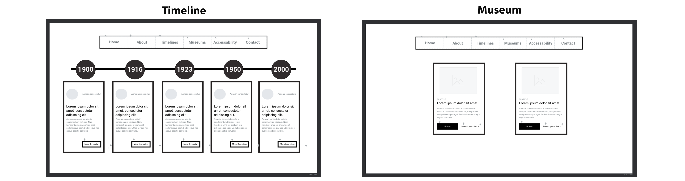
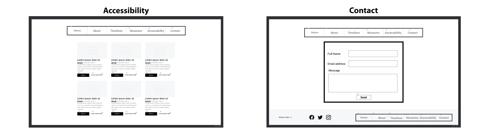
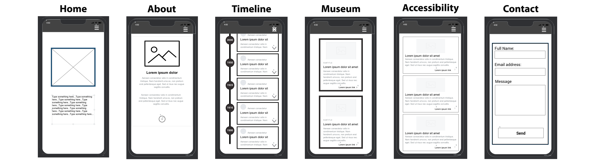
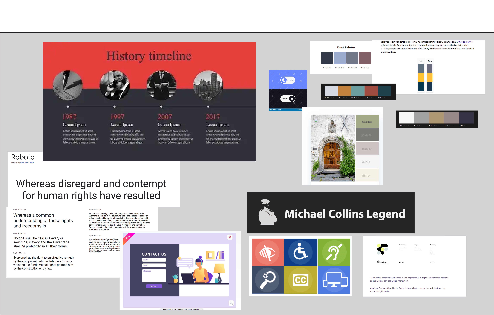

Logo: Michael Collins Legend
----------------------------------------


The site is Michael Collins's history. The target is users who are interested to know more about him, and who are hobbies or the student’s projects of history. 


Features
-------------

This website links outside sites where it has depth information. The aim is easier for the users to find links and follow Michael Collins’s information for their users’ convenience.

Existing Features
-----------------------
### Navigation Bar

* The page sections are five links, including a responsiveness navigation bar and a three-dash button to the dropdown menu. 
* The sections are Home, About, Timelines, Museum, Contact, and Footer, it is all include responsiveness.

### Desktop/laptop responsive


### Tablet/Mobile devices for responsive


### Tablet/Mobile Devices for dropdown menu responsive**


### Home section
* Images on the left side and text on the right.
* Brief text to story about Michael Collins
* The art image is powerful and shows how he was a legend.
* The painting by Leo Whelan painting.



### About Section
* Image of headstone display and text brief about the site.


### Michael Collins's history of the Timeline section

* On the timelines, a page is a brief story in the timeline years and a link at the bottom box, it gives further information outside sites and gives more depth about his stories. 
* Hovering on the image will make the size enlarge.


### Museum Section

* The site is together with information links from outside sites to look at the museums' page link to direct and buy a ticket who wish to visit the museums. 


### Contact section

* Send a request for the users who require accessibility building or other comments as they request.  


### Footer Section
* Display on the logo, social media and site maps.
* Link to the social media directions either 
* Facebook, Twitter, Instagram or YouTube for further information on Michael Collins history.  
* Site maps add in the case for users’ convenience to links to go back home, about, timeline, museum or contact. 


### Testing

 * The testing has been browsers, are Chrome, Firebox, Safari, Opera and Edge. There are a few problems which are Safari, does not support therefore use “scroll-behaviour: smooth;” in the CSS style. I searched to find what is it problem but it would need to use JavaScript.

* The testing runs Chrome, Opera, Microsoft Edge and Firefox and it does support them. All the screens are fine and responsive but sight little different sizes of aspect screens. 


### The lighthouse runs testing and results.




### Validation testing

#### HTML
* Had been found few errors when the test run through the official W3C validator.
- Incorrect open and closed by div and nav, and incorrect tag rule, I had to do the fixed bug and it was all pass and no errors.

#### CSS
- Had been found four errors through the official (Jigsaw) validator.
- Missing px and incorrect %, I had to do the fixed bug and it was all pass and no errors.

### Deployment

The GitHub page where is deployed. How do processing the site deployed as follows:

* Use files on the GitHub page and choose one of the files where it is in the “portfolio-project-1-robert-quinlan” file
* Click on setting 
* On the left side follow the list of options
* To click on ‘page’
* The source under the option to “Deploy from a Branch”
* The Branch under to open to main and root then click to save. 
* It ran the deployment processing while it is successful.

The site lives at [Michael Collins Legend](https://rqisl.github.io/portfolio-project-1-robert-quinlan/)

## Credits
_________________________________________________________
### **Please note:** 
* English is not my first language as my first language is ISL (Irish Sign Language).
____________________________________________________________________________________
I learned through the course in Code Institute. I do most learning of different open source on 3WC it helps to remember what the code used tags and style CSS for HTML and CSS, also what I am interested in as scroll smooth, icons, and transitions. I did a few learning to CodePen. 

My mentor had good feedback and helps to my process improvement on site project. 

## Here is my projects: 
________________

### Contents

* I was interested in the active current on the section page. I took the jQuery, it comes from [CodePen.](https://codepen.io/arjunamgain/pen/RwWoQM)  

### Favicon 
* I use of my previous personal website which is now not on the server anymore. I copied the folder to here and replace icon image through photoshop. 

See the image icon on head of the site



### Social media icons

* I took the social media icon from the [3CW school.](https://www.freepik.com/free-vector/social-media-logo-collection_3966112.htm#query=social%20media%20icon&position=7&from_view=keyword) 

### Specifies size screen for responsive
* I searched and find the link [Screen size responsive,](https://screensiz.es/monitor) it helps me to know the exact screen size from Desktop, laptop, tablet and mobile devices for the queries media responsiveness.

* I use MacBook pro laptop with a 17” screen and it is very hard to know approx for large desktop screen.

### What I did using queries media list in the CSS.
``` markdown
/*Desktop responsive*/
@media only screen and (max-width: 2070px) {…………}
```

``` markdown
 /* large tablet and small laptop responsive*/
 @media only screen and (max-width: 1354px)  {…………}
```

``` markdown
/*tablet responsive from 650px up to 950px) */
 @media only screen and (max-width: 950px)  {…………}
```

``` markdown
/* large mobile, from 450px up to 750px */
@media only screen and (max-width: 750px) {…………}
```

``` markdown
/* mobile standard responsiveness  for max 450px screen*/
@media only screen and (max-width: 450px)  {…………}
```

``` markdown
 /* small mobile responsiveness  for max 350px screen*/
 @media only screen and (max-width: 350px) {…………}
```

``` markdown
/* smaller mobile  responsiveness */
@media only screen and (max-width: 320px)  {…………}
```

### The dash button icon

* I took an icon dash button from [3WC School.](https://www.w3schools.com/howto/howto_css_icon_buttons.asp)

### Timeline 

* I did create my own CSS for the timeline history. I had experienced difficulty with a responsive timeline. I decide to copy from [3WC School for the timeline](https://www.w3schools.com/howto/tryit.asp?filename=tryhow_css_timeline) and I had a few modifications to make the position fit the screen and also responsiveness. The reason is to prevent my time delay. 


### Media

* All the images come from Michael Collins’s Wikimedia and are free to share and link the images and embed a file from Wikimedia. It is in the public domain.

* I like the two images on my site of the project. The mentor pointed out the rights of the images  who are holders' rights. I was concerned about the images, I asked one of the Cohort Facilitators. He instructed me to use a reference and give an example:

``` markdown
Creator, Year. Title [Online]. Place of publication: Publisher (if known). Available from: URL [Accessed date].

e.g. NASA, 2015. NASA astronaut Tim Kopra on Dec. 21 spacewalk [Online]. Washington: NASA. Available from: https://www.nasa.gov/image-feature/nasa-astronaut-tim-kopra-on-dec-21-spacewalk [Accessed 7 January 2015].
```

### Detailed references:

The references holders' images details are: 

* Leo Whelan (10 January 1892 – 6 November 1956
), Fine Art Painting,  Available from: https://www.historyireland.com/michael-collins-military-dictator/  [Accessed 12 December 2023].

* Janice O Connell f22 Photography,  Available from: <https://www.google.com/search?q=michael+collins+house+cork&tbm=isch#imgrc=OcxaVe7zvb0x1M>  to Facebook page [Accessed 12 December 2023].


### Adobe Photoshop

* The logo of Michael’s head silhouette images where I created the Photoshop. Also, Michael’s head on the Doric image which is downloaded comes from [www.vecteezy.com](https://www.vecteezy.com/vector-art/11014285-museums-museum-columns-museum-lines-museum-pillar-logos-museums-with-minimalist-and-modern-concepts-logos-can-be-used-for-companies-museums-and-businesses) to editing together Michael’s head silhouette and Doric.

### Photoshop images

### Logo 


### Michael's head sillhoette and Droic together image


## Concept Project

Where I did concept project for the Michael Collins' History. The projects follows below:

### Brainstorm 

* The five planes — strategy, scope, structure, skeleton, and surface where I learned [the five planes](https://www.uxdesigninstitute.com/blog/5-elements-of-ux-design/) and I used the XMind app for project management but I created a mindmap for the project. The brainstorming is very useful therefore it would be running smoothly organised.

### See a screenshot of the mindmap.

 

 ### Sketch UX

* I was just a quick sketch idea of the site then moved on to Justinmind app.

* See picture below:


### Wireframe by Justinmind

* I downloaded the Justinmind app for the wireframe I designed a wireframe and learned how use creates a wireframe. It had a lot more work than I expected because I want to create an interactive wireframe mobile. 

* I asked to mentor for advice through chat on Stack. He instructed that just only use design wireframes. I stop to do further what I was trying to create interactive because the time was taking a lot. I moved to start building HTML and CSS.  

### The screenshot desktop and mobile wireframes are here: 

* ### Desktop







* ### Mobile



### Remove the Accessibility Section Page

* I decided to leave out the accessibility page because I was not the able chance to create it. After all, it took a lot of work with CSS and responsiveness. I learned a lot of CSS and I would get better next time. 

* What I did a concept the accessibility to design for focus users who are preferred toggle light/dark mode and for the visually impaired change background to black and foreground yellow for text. Also for text medium to large options to suit the users’ preferences. 

### Research and collection links

#### I did the research for open-source HTML & CSS. I collected links and I wish to keep them for the next time I may able to design for accessibility in the future. 

1)  [Accessibility UX example](https://www.museum.ie/en-ie/accessibility)

1) [Example icon for accessibility](https://castlegarsource.com/news/government-introduces-legislation-build-more-accessible-inclusive-bc)

1) [Dark mode HTML](https://www.geeksforgeeks.org/how-to-make-dark-mode-for-websites-using-html-css-javascript/amp/)

1) [Choice of Light and dark design](https://www.dreamstime.com/day-night-switch-icon-dark-mode-light-button-mobile-app-interface-design-concept-image184942820) 

1) [For example, click on dark mode](https://redstapler.co/pure-css-minimal-dark-mode-toggle-button/)

1) [Responsive grid use CSS](https://travishorn.com/responsive-grid-in-2-minutes-with-css-grid-layout-4842a41420fe)


### Moodboard 

* The moodboard is an arrangement of images, materials, pieces of text, etc. intended to evoke or project a particular style or concept. It helps to see clearly what you would like to design for the site. I put label images for the timeline, colour pallets, footer, icons accessibility, font of Roboto, light/dark mode, contact, and logo.

* I used the Adobe Illustrator app and create a moodboard. 

See the image below:



### Colour Pallet

* I choose the colour pallet because the style is matching to Michael Collins’s history style, green Ireland, soldier uniform and oldest building. It caught my eye with the colour which I found and I like it to match the website. 

1) When I ran the test through the lighthouse and it had issues with contrast colour. 
1)I had to change to get dark from #7a7a76 to #252424 for the button link to external sites. 
1)The footer background get dark from #7a7a76 to #252424.
1) The timeline and museum sections also for the button link to external sites. 
1) The navigation menu bar gets darker from #7a7a76 to #252424 to prevent the match from the footer when you scroll up to menu bar.

### Image colour pallet

* I took the screenshot image to choose the image colour palette from [www.icolorpalette.com](https://icolorpalette.com/imagepalette)

See the image of the colour palette below:


### Concluded 

* I completed my concept project for the Michael Collins Legend’s website and included responsiveness. I hope you enjoy my project on the Michael Collins Legend site. The site lives [Michael Collins Legend](https://rqisl.github.io/portfolio-project-1-robert-quinlan/).


 

 


